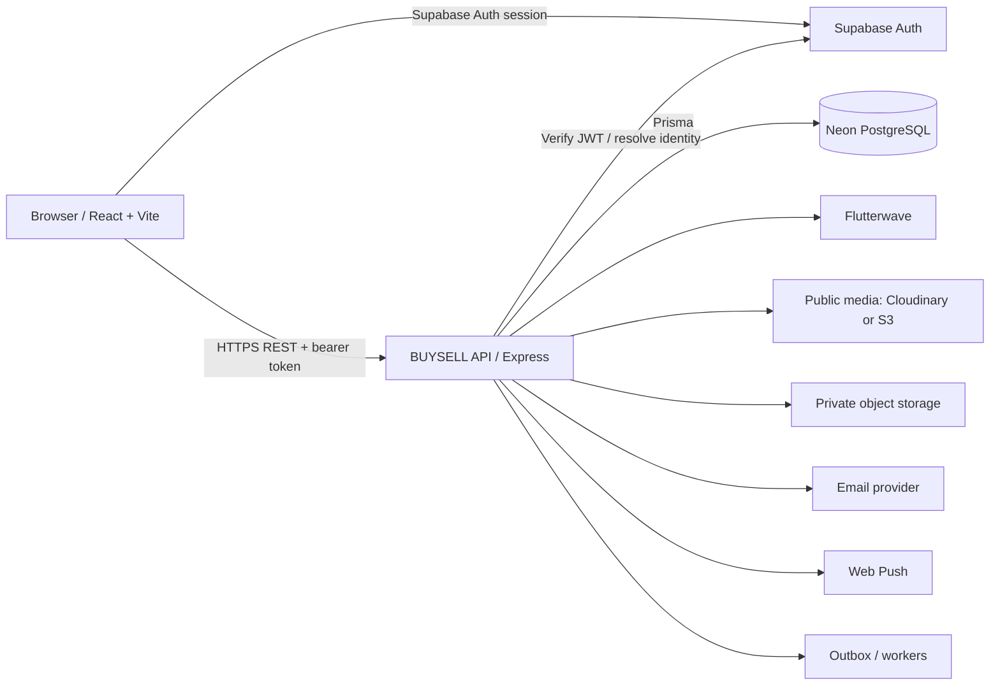
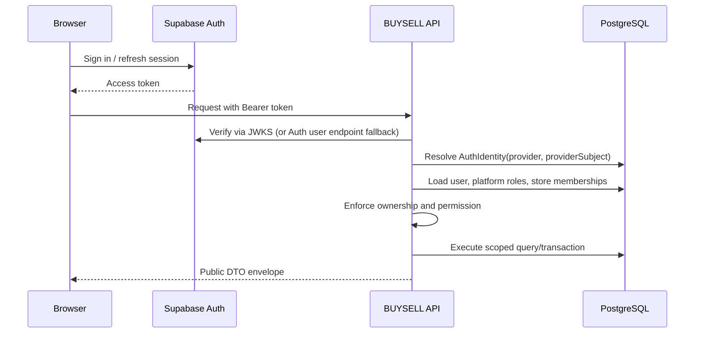
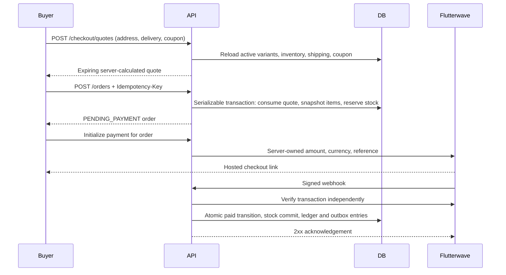
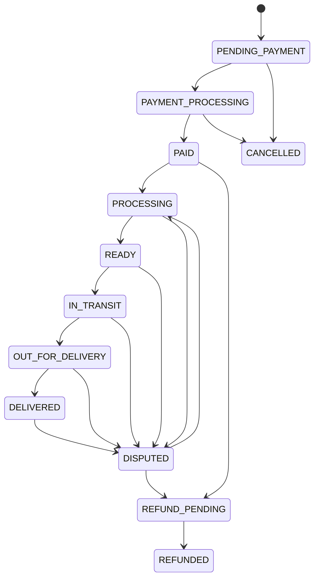
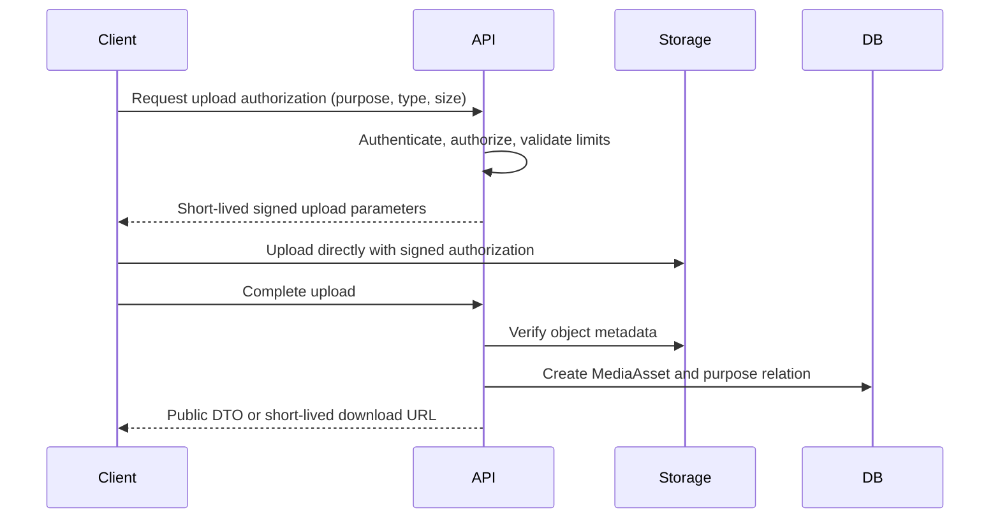
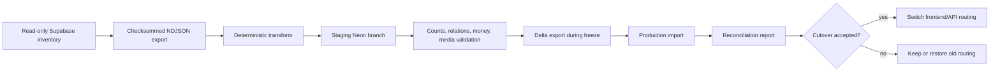

# BUYSELL architecture

## Purpose

BUYSELL is a Nigerian multi-sided marketplace serving buyers, stores, suppliers, service providers, delivery operations, and platform staff. The rebuild replaces the legacy browser-authoritative application with an independently deployable React frontend and Node API. Supabase remains the identity provider during the first migration stage; it is not the commerce database for the rebuilt client.

## System architecture

The trust boundary is the API. The browser may use Supabase for sign-in, sign-out, password recovery, OAuth, and session refresh. Product, order, payment, finance, sourcing, KYC, messaging, advertising, and administration data is read or changed only through the BUYSELL API.

## Repository responsibilities

| Area | Responsibility |
| --- | --- |
| `frontend/` | React Router application, layouts, UI state, API client, Supabase Auth client, query caching, accessibility, and SEO metadata. |
| `backend/` | Authentication resolution, authorization, validation, domain services, integrations, stable DTOs, audit logging, and REST routes. |
| `database/` | Prisma model, migrations, seed fixtures, indexes, and database invariants. |
| `scripts/migration/` | Read-only source inventory, resumable export, transforms, import, reconciliation, and reports. |
| `docs/` | Contracts, operating procedures, migration controls, and implementation record. |

The intended backend dependency direction is `route -> middleware -> service -> Prisma/integration -> serializer -> response`. A route may be thin, but price, inventory, payment, payout, permissions, and status-transition rules must not be duplicated in route handlers or the frontend.

## Request and authentication flow

`AuthIdentity` decouples an external subject from the internal `User`. Existing Supabase user UUIDs remain authoritative provider subjects, allowing account continuity without making the commerce schema depend permanently on one identity vendor. Editable user metadata is never used as an authorization source. Platform role assignments and store memberships live in PostgreSQL.

## Checkout and payment flow

The frontend never submits an authoritative total. Money is stored in integer minor units (`*Kobo` for NGN). Provider callbacks and webhooks are signals, not proof: the API verifies status, exact reference, currency, and sufficient amount against the order. Unique references, idempotency keys, and transactions prevent duplicate orders or ledger effects.

## Order lifecycle

Not every order traverses every state. The service owns an explicit transition map and writes `OrderStatusEvent` records. A parent `Order` represents the buyer checkout; one `StoreOrder` per participating store allows independent seller fulfilment and finance allocation while retaining a single buyer payment.

## Media flow

Public catalog media may use Cloudinary or a public S3-compatible bucket. Identity documents, dispute evidence, and other sensitive objects use a private bucket; their database records do not contain permanent public URLs. Access is checked again before a short-lived download URL is issued.

## Data migration flow

Exports are immutable, checksummed, and resumable. Source database backup and Storage-object backup are separate requirements. The source remains intact through verification and rollback retention.

## Cross-cutting rules

- Every API list is bounded and paginated; sorting and filters use allowlists.
- All responses use `{ success, data, meta? }` or `{ success: false, error }`; internal exceptions are logged, not returned.
- Public DTOs are explicit. Prisma records with internal relations are never serialized directly.
- Store-level access requires active membership plus a permission; platform-level access requires a database role assignment.
- Sensitive actions produce `AuditLog` records; asynchronous work is recorded in `OutboxEvent` before delivery.
- Timestamps are UTC. Presentation uses the visitor's locale. NGN values use integer kobo.
- Soft deletion is used where history or ownership must survive. Financial and audit records are append-only or status-driven, not hard-deleted.
- Production uses a pooled Neon connection for application traffic and a direct connection for Prisma migrations and administrative operations.

## Deployment topology

The frontend is a static Vite build served by a CDN/SPA-capable host. The API runs as a Node service with HTTPS, health/readiness checks, structured logs, and access to provider secrets. Neon environments/branches isolate development, staging, preview, and production. Supabase Auth settings list the exact frontend callback URLs. Media and email providers are optional locally but required for their corresponding production flows.

See [DEPLOYMENT.md](DEPLOYMENT.md), [SECURITY.md](SECURITY.md), and [PRODUCTION_CUTOVER.md](PRODUCTION_CUTOVER.md) for operational controls.
