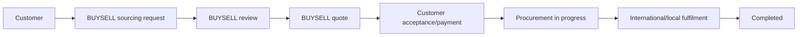
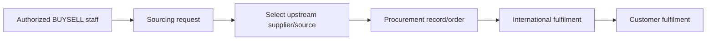

# BUYSELL Product Sourcing architecture

## Non-negotiable boundary

> Upstream procurement sources are internal implementation details and must not be exposed through public APIs or customer-facing UI.

The public service is named **BUYSELL Product Sourcing** (or simply **Sourcing** in compact navigation). It accepts requests for products that may not already be listed. BUYSELL reviews the request, provides a customer quote or next step, coordinates procurement, and reports understandable fulfilment progress. The public experience is provider-neutral.

## Public model

Customers submit product title/description, quantity, specifications, target budget, reference image, optional generic reference URL, delivery location, desired date, and notes. A reference URL may point to any legitimate source. If the customer supplied it, policy may return that same value as `referenceUrl`; it is represented as the customer's reference and never as BUYSELL's endorsed provider.

Customer-facing data comprises `SourcingRequest`, `SourcingItem`, `SourcingQuote`, `SourcingStatusHistory`, and a membership-protected sourcing conversation. Quotes expose only the amounts and terms BUYSELL intentionally offers: subtotal, service fee, shipping, total, expiry, and estimated delivery.

## Internal model

`SourcingProcurement` is a separate one-to-one internal relation. It may contain a generic `SourcePlatform` classification, server-side provider code, supplier/source URL, supplier references and order identifiers, source currency and costs, exchange rate, international/local costs, internal status, and operations notes. Existing legacy source links are migrated here rather than deleted.

This relation is never included by default when loading a customer request. Internal handlers must request it deliberately and pass the result through the admin serializer.

## Access control

| Capability | Eligible principal |
| --- | --- |
| Create request | Authenticated customer/seller (`sourcing.request.create`) |
| Read/update own draft | Request owner (`sourcing.request.read_own`) |
| Read/accept own quote | Request owner (`sourcing.quote.read_own` / `accept_own`) |
| Participate in request conversation | Request owner or assigned authorized staff |
| Read internal procurement | `OPERATIONS_ADMIN`, `SOURCING_MANAGER`, `SUPER_ADMIN` via `sourcing.internal.read` |
| Edit internal procurement | Same role set via `sourcing.internal.write` or `sourcing.procurement.manage` |
| Assign and progress operational work | Authorized operations/sourcing role, recorded in audit/history |

Frontend route guards are presentation only. The API scopes public queries to `requesterId = req.user.id` and applies platform permissions on internal routes.

## DTO contract

`toPublicSourcingRequest()` returns only public fields, items, customer quote/status/history, and user-safe message metadata. It must construct a new object. It must not spread the Prisma record or serialize `procurement` even when a caller accidentally included it.

`toAdminSourcingRequest()` may add an `internalProcurement` section, but only after `sourcing.internal.read` is checked. Write responses apply the same serializer as read responses. Internal and public concerns should be visually separated in the admin workspace.

Forbidden in ordinary customer/seller responses:

- detected source platform or provider code;
- upstream/source URL not supplied as the customer's own reference;
- supplier account, identifier, private link, chat, or order reference;
- procurement unit price, source shipping, internal exchange assumptions, margin, or internal notes;
- internal supplier relation or raw database object.

## Status vocabulary

Public status values are `DRAFT`, `REQUEST_SUBMITTED`, `UNDER_REVIEW`, `MORE_INFO_REQUIRED`, `QUOTE_READY`, `AWAITING_PAYMENT`, `PAYMENT_CONFIRMED`, `PROCUREMENT_IN_PROGRESS`, `PROCURED`, `INTERNATIONAL_TRANSIT`, `ARRIVED_IN_COUNTRY`, `LOCAL_FULFILMENT`, `COMPLETED`, and `CANCELLED`. UI copy translates these into concise updates without claiming warehouses, fleets, partnerships, or supplier relationships BUYSELL has not verified.

An internal procurement status may be more granular, but it is never passed through as public status. Every customer-visible transition writes `SourcingStatusHistory`; sensitive operational detail belongs in the procurement record or audit log.

## Routes and compatibility

Canonical public routes are `/sourcing`, `/sourcing/new`, and `/sourcing/:requestId`. Seller routes are `/seller/sourcing`, `/seller/sourcing/new`, and `/seller/sourcing/:requestId`. Operations routes are under `/admin/sourcing`.

Historic provider-branded URLs permanently redirect to the corresponding neutral route. They do not appear in navigation, sitemap, canonical tags, public copy, email templates, or analytics names. The legacy literal may remain only in internal migration mapping/documentation necessary to recognize old records and URLs.

## Server-side configuration

Provider-specific adapters and `PROCUREMENT_SOURCE_PROVIDER` are backend-only. No procurement credential or source identifier may use a `VITE_*` environment variable. Public telemetry uses generic names such as `sourcing_request_created`, `sourcing_quote_accepted`, `procurement_started`, and `sourcing_completed` and excludes internal payloads.

## Verification checklist

- With an ordinary buyer and seller account, inspect request/list/detail/quote/message responses and browser storage.
- Confirm no internal procurement fields, supplier data, raw costs, or provider codes appear in JSON, HTML, React props, console logs, analytics, hidden inputs, images, or bundle strings.
- Confirm one account cannot guess another request or conversation ID.
- Confirm internal fields are unavailable to support/content/finance roles without the sourcing permission.
- Confirm only authorized operations roles can read and write the admin procurement pane and that changes create audit entries.
- Confirm arbitrary valid reference URLs are accepted safely and rendered as external, no-opener links.
- Search the built frontend and sitemap for legacy provider branding and provider-specific routes.
- Confirm redirects are permanent and their destination declares the neutral canonical URL.
